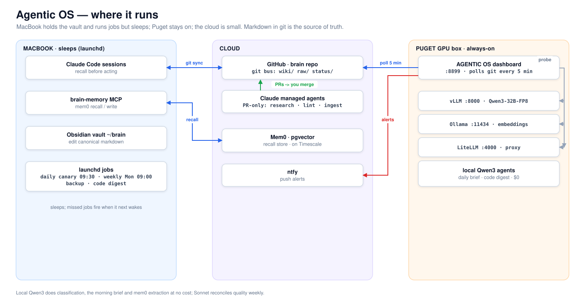
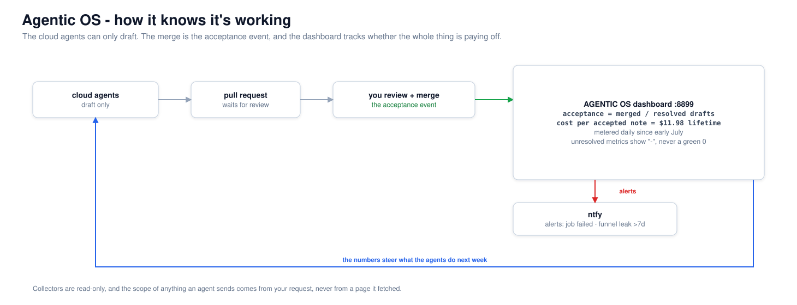
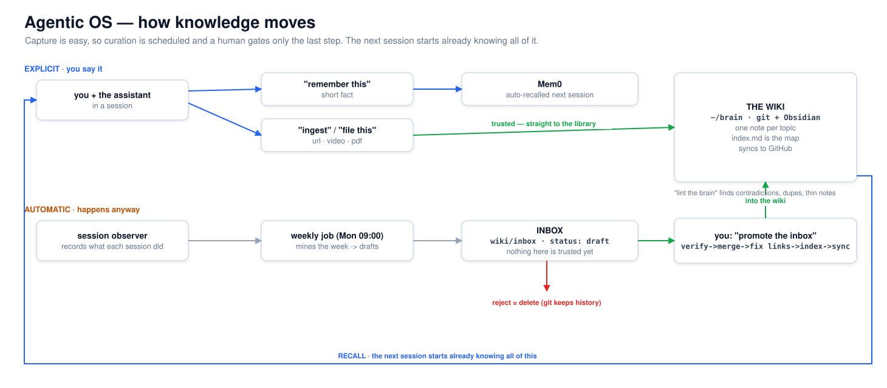

# Agentic OS

A memory that every AI assistant I use reads before it does anything, and that keeps
itself in order while my laptop is shut.

I got tired of re-explaining the same context to Claude every morning: last week's
decision, the gotcha that cost me a day, which account wants which convention. So I built
a brain that learns something once and hands it back at the start of the next session, in
whatever project I'm in. The vector database is disposable. The actual knowledge is
markdown in git, so nothing is trapped and I can read my own history with `git log`.

This repo is the architecture. It is not the data. There are no memories here, no customer
names, no credentials. If you want to build your own, the design is below and you can copy
all of it.

Three machines do the work. My MacBook holds the Obsidian vault and runs the daily jobs,
but it sleeps, so anything that has to stay up lives on a Puget GPU box at home. The cloud
part is deliberately small: a Mem0 pgvector store on a Timescale instance, and a handful of
Claude-managed agents that are only ever allowed to open a pull request.

## The one habit that makes it work

Recall before acting. At the start of any non-trivial task the assistant searches the brain,
so a decision I made on one account shows up when I'm working the next one. Writing a memory
is the easy half. Reading it first is the half that pays. That rule lives in the system
prompt of every assistant, next to two others: write durable facts, never transient state,
and never store a secret.

Everything reaches the brain through two MCP tools, `search_memory` and `add_memory`. A new
coding agent or a chat window joins by being told those three rules. No SDK, no per-tool
plumbing.

## Markdown is the truth. The database is a cache

Most "AI memory" products make the database the source of truth, and your knowledge dies
inside it the day the vendor changes. I inverted that. The canonical copy is a git repo of
markdown I read in Obsidian. The embedding store is derived data. If it corrupts, or I want
to move off Mem0, I re-index from the markdown and lose nothing. I can also `git blame` a
decision and see when I changed my mind and why.

## It measures whether it's actually working

This is the part I'm proudest of, and it's the part most second-brain setups skip. The
system reports on itself. A dashboard on the Puget box (`:8899`) pulls the git repo every
five minutes and tracks two numbers: acceptance, meaning notes I promoted and merged over
all the drafts it proposed, and cost per accepted note. Lifetime spend on the cloud agents
is $11.98 since early July, metered daily. Unresolved metrics render as ", ", never as a
green zero, so a broken job can't look like a passing one.

The cloud agents can only draft. They open PRs. I merge. The merge is the acceptance event.
Collectors are read-only. The scope of anything an agent sends comes from my request, not
from a web page it fetched, which closes the obvious prompt-injection hole.

## What I actually type at it

Most of it is automatic. The weekly job mines the week and drops draft notes into an inbox
that nothing trusts yet. When I say "promote the inbox" it verifies each draft, merges it,
fixes the `[[links]]`, updates the index, runs a health check, and syncs. "remember this"
writes a short fact to memory. "ingest this url" pulls an article or a video transcript into
staging. "lint the brain" finds contradictions, duplicates and thin notes. Reject a draft
and it's deleted, but git keeps the history.

## How it's put together

| Layer | What it does | Built on |
|---|---|---|
| Recall | cross-project read/write over two MCP tools | Mem0 pgvector on Timescale |
| Canonical | long-form knowledge, one note per topic, git-versioned | Markdown + Obsidian |
| Ingestion ("Jarvis") | classify, route, store, graph each new item | local Qwen3 via vLLM/Ollama |
| Cadence | canary, weekly maintenance, contradiction check, backup | launchd on the Mac, cron on Puget |
| Cloud agents | research, lint, ingest, promote, PR-only | Claude managed agents |

The models are split by cost. Classification, routing, the spoken morning brief and mem0
extraction run on a local Qwen3-32B and cost nothing. Sonnet reconciles quality once a week.

Longer detail: [architecture](docs/ARCHITECTURE.md), [how the agents connect](docs/AGENTS.md),
[the hooks](docs/HOOKS.md), [the cadence](docs/CADENCE.md), [why it's built this way and how it
compares](docs/WHY.md), the [design decisions and threat model](docs/DESIGN-DECISIONS.md), and the [design philosophy](docs/HARNESS.md).
Sanitised job skeletons are in [templates](templates/).

## Finding other agents: DNS-AID

The assistants reach their own tools over MCP. Finding other agents is a different problem, and I
didn't want hardcoded endpoints or a central registry owning the list. That job goes to DNS-AID. It
publishes an agent's endpoint and capabilities as SVCB records (RFC 9460) in ordinary DNS, and
validates them with DNSSEC and DANE, so discovery rides the naming system the internet already runs.

I wrote the reference implementation from scratch. DNS-AID was accepted as a Linux Foundation project
on 27 May 2026, with Cloudflare, GoDaddy, Equinix, ISC and Infoblox in the founding coalition, and
it's an IETF dnsop draft (`draft-mozleywilliams-dnsop-dnsaid`). The implementation carries the
publisher, a DNSSEC/DANE validator, an SDK, an MCP server, and a directory service. Code and spec:
https://github.com/dns-aid/dns-aid-core

## Build your own

1. Stand up a vector-memory service and expose `search_memory` and `add_memory` to your
   assistant over MCP.
2. Make a git repo of markdown for the real knowledge. Add an `inbox/` for drafts and a
   folder for weekly reports.
3. Put three rules in every assistant's system prompt: recall before acting, write durable
   facts not transient state, never store secrets.
4. Add two scheduled jobs to start: a daily recall canary and a weekly lint that drafts
   promotion candidates. Skeletons are in `templates/`.
5. Keep the database disposable. Prove you can wipe it and rebuild from the markdown.

## What this repo is not

It is not my brain. No memories, no account detail, no customer content, no real scripts,
just the design, so you can build yours.

## License

MIT. See [LICENSE](LICENSE).
