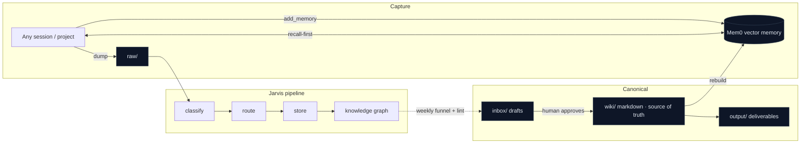

# Cortex — a self-maintaining second brain for AI assistants

**A reference architecture (not the data).** This repo documents *how* I wired a persistent,
cross-project memory and knowledge system into the way I work with AI assistants. It contains the
design, the data flow, the cadence, and sanitized templates — **none of the private knowledge**. The
point is the pattern, so anyone can rebuild their own.

> The problem: an AI assistant that forgets everything between sessions is a very expensive goldfish.
> Every Monday you re-explain your accounts, your decisions, and the gotchas you already hit. Cortex
> is the fix — a brain the assistant **recalls from before it acts** and **maintains itself** while
> you sleep.

## What it is, in one diagram

## The five ideas worth stealing

1. **Recall-first.** Before starting any non-trivial task, the assistant searches the shared brain —
   so a decision made on one account surfaces on the next. Memory is a *read* habit, not just a write.
2. **Markdown is canonical; the vector DB is a cache.** The entire brain is rebuildable from
   git-versioned markdown. The embedding store can be wiped and re-indexed at any time. Your knowledge
   is never trapped in a database.
3. **Human-approved promotion.** New knowledge lands in an `inbox/` as drafts. It only enters the
   canonical wiki when a human says "promote" — which blocks drift, duplication, and memory poisoning.
4. **It maintains itself.** A daily *recall canary* proves the memory still answers; a weekly pass
   lints the knowledge base and drafts promotion candidates; a *contradiction hook* flags notes that
   disagree; an *evolution proposer* suggests improvements to the brain's own design.
5. **Cheap work runs locally.** Classification, routing, and summarization go to a local LLM; only the
   hard reasoning spends a frontier model.

## How it's put together

| Layer | Role | Public tooling it's built on |
|---|---|---|
| Durable memory | cross-project recall/write via two tools (`search_memory`, `add_memory`) exposed to every assistant over MCP | a vector-memory service (e.g. Mem0) |
| Knowledge base | long-form, git-versioned, human-readable source of truth | Markdown + Obsidian |
| Ingestion ("Jarvis") | classify → route → store → graph a new fact | local LLM + a small graph store |
| Cadence | daily canary, weekly maintenance, contradiction detection, evolution proposer, backup | cron / launchd / systemd |
| Surfaces | a dashboard, a spoken daily brief, a heartbeat/graph publish | Streamlit, TTS |

See **[docs/ARCHITECTURE.md](docs/ARCHITECTURE.md)** (components), **[docs/AGENTS.md](docs/AGENTS.md)** (how assistants + the ingestion agent connect), **[docs/HOOKS.md](docs/HOOKS.md)** (the automation), and **[docs/CADENCE.md](docs/CADENCE.md)**
for the self-maintenance loop. **[templates/](templates/)** has sanitized skeletons of the cadence jobs.

## Replicate it

1. Stand up a vector-memory service and expose `search_memory` / `add_memory` to your assistant (MCP).
2. Make a git repo of markdown for the canonical knowledge; add an `inbox/` and a `_consolidation/` folder.
3. Tell your assistant two rules: **recall before acting**, and **write durable facts, not transient state**.
4. Add the cadence jobs (templates provided): a daily recall canary, a weekly lint + promotion draft.
5. Keep the DB disposable — prove you can rebuild it from the markdown.

## What this repo is NOT

It is **not** my actual brain. There are no memories, no account details, no customer data, and no
private scripts here — only the architecture, so the idea can spread.

## License

MIT — see [LICENSE](LICENSE).
