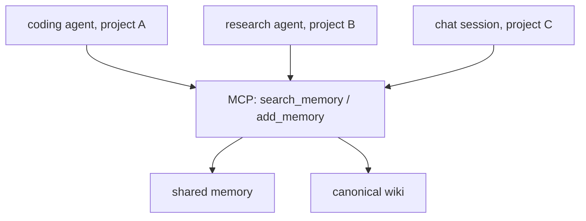
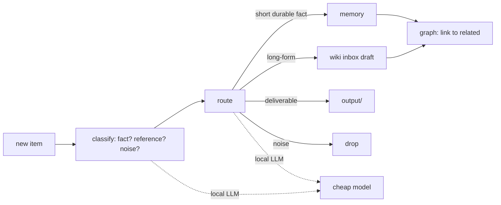

# Agents, how the thinking parts connect

Agentic OS is not one agent. It is a **recall layer that every assistant shares**, plus a small internal
**ingestion agent** that curates what goes in. Keeping those two roles separate is the key design move.

## Two kinds of agent

### A. The assistants that *use* the brain (many, external)
Any AI assistant, a coding agent in one repo, a research agent in another, a chat session, plugs in
the same way: through two MCP tools.

The contract each assistant follows is tiny and lives in its system instructions:

1. **Recall before acting**, `search_memory` at the start of non-trivial work.
2. **Write durable facts, not transient state**, `add_memory` with `domain` + `project` tags.
3. **Never store secrets** or anything already in code/git.

Because all of them share one memory, a decision made by the coding agent in project A is visible to
the research agent in project B. That cross-pollination is the whole point.

## Finding other agents: DNS-AID

The assistants above reach their own tools over MCP. Agent-to-agent discovery is a separate problem,
and this ecosystem solves it with DNS-AID rather than a central registry or hardcoded URLs. An agent's
endpoint and capabilities are published as SVCB records (RFC 9460) in DNS and validated with DNSSEC and
DANE. I wrote the reference implementation from scratch. DNS-AID is a Linux Foundation project (accepted
27 May 2026, founding coalition Cloudflare, GoDaddy, Equinix, ISC, Infoblox) and an IETF dnsop draft,
draft-mozleywilliams-dnsop-dnsaid. See https://github.com/dns-aid/dns-aid-core.

### B. The ingestion agent that *curates* the brain ("Jarvis", internal)
A small pipeline decides what each incoming item is and where it belongs, so the brain stays clean
instead of becoming a junk drawer.

Classification and routing run on a **local model** (private, cheap, fast). Only genuine synthesis , 
merging notes, writing a concept page, spends a frontier model. The **graph** records relationships
so retrieval can follow connections, not just match text.

## Model routing

| Task | Model tier |
|---|---|
| classify / route / tag | local LLM (small, fast) |
| summarize / brief | local LLM |
| synthesize a concept page, resolve a contradiction | frontier model |

Routing by cost keeps the always-on parts free and private, and spends real tokens only where
judgment is needed.
