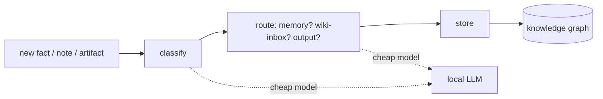
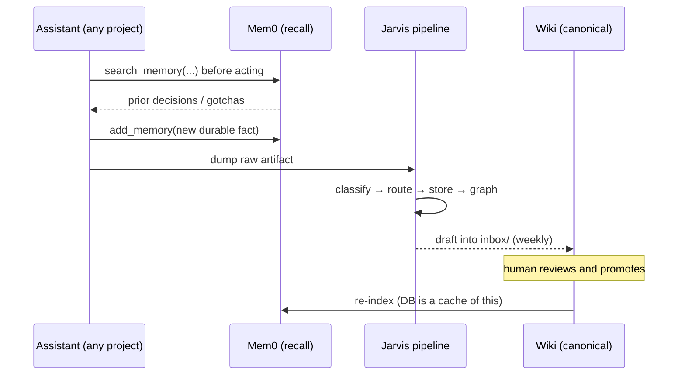

# Architecture

Cortex is four layers and one rule. The rule: **markdown is the source of truth; everything else is a
cache you can rebuild.**

## Components

### 1. Durable memory (the "recall layer")
A vector-memory service holds short, durable facts — decisions, conventions, gotchas — tagged by
domain and project. It is exposed to every AI assistant through exactly two MCP tools:

- `search_memory(query, [domain], [project])` — called at the **start** of non-trivial work.
- `add_memory(fact, domain, project)` — called when something is worth knowing in a future session.

It is deliberately small and disposable. It is re-indexed from the knowledge base whenever needed.

### 2. Knowledge base (the "canonical layer")
A git repository of Markdown, viewed in Obsidian. Long-form knowledge lives here: `concepts/`,
`projects/`, plus two working areas — `inbox/` (unapproved drafts) and `_consolidation/` (weekly
reports). Because it is plain text in git, it is diff-able, reviewable, and permanent.

### 3. Ingestion pipeline ("Jarvis")
New information is processed by a small pipeline rather than dumped straight into memory:

Classification and routing use a **local LLM** (cheap, private); only hard synthesis spends a frontier
model. The graph store captures relationships between notes so the system can reason over connections,
not just retrieve single facts.

### 4. Surfaces
- A **dashboard** (Streamlit) to browse state and health.
- A **spoken daily brief** — the day's relevant knowledge, read aloud.
- **Heartbeat / graph publishing** so the brain's state is observable.

## Data flow, end to end

## The boundary that keeps it honest

Several local caches exist (editor memory plugins, code-context tools, symbol indexers). They are
convenient but **lossy and machine-specific**. The rule is simple: when a cache disagrees with the
canonical markdown, **the markdown wins**, and the cache is rebuilt. This is what makes the whole
system portable and trustworthy.
