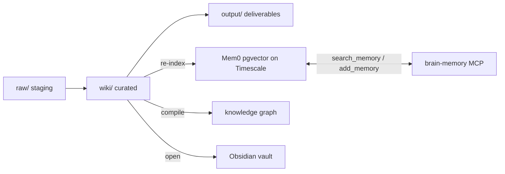
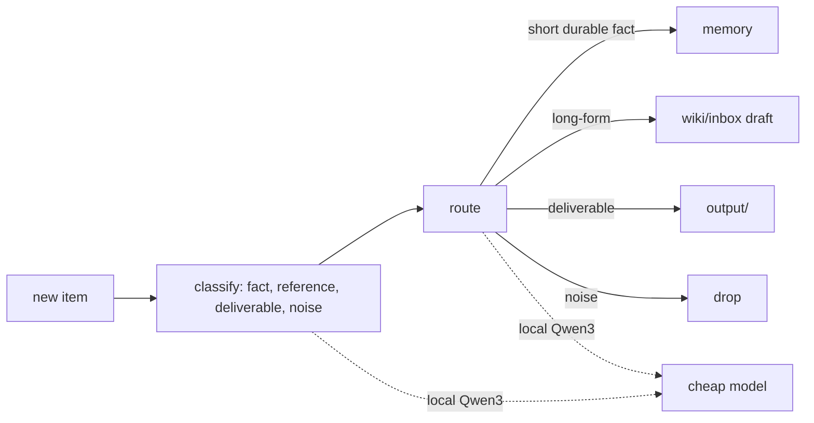

# Architecture

Four layers and one rule. The rule: markdown is the source of truth, and everything else is a cache I
can rebuild.

## The four layers

**Source of truth.** A git repo of markdown in `~/brain`, in three stages: `raw/` is staging (a dropped
article, a transcript, a half-formed idea), `wiki/` is the compiled, curated knowledge (one note per
topic), and `output/` holds deliverables the brain produced. This is canonical. Everything below is a
projection of it.

**Recall spine.** Mem0 extracts short facts from what I tell it and stores the vectors in a Postgres
pgvector database on a Timescale instance. Every project reaches it through one MCP server,
`brain-memory`, with two tools. The store is disposable. It is re-indexed from the markdown.

**Structure.** A graph compiler turns `~/brain` into a queryable knowledge graph, so the system can
follow relationships between notes instead of only matching text.

**Surface.** Obsidian opens `~/brain` as a vault to read and edit, a Streamlit dashboard shows live
state and health, and a local model reads a spoken brief each morning.

## The scoping rule

One constant user id across every project means one shared brain. Each memory is tagged with a domain
(research or engineering) and a project, so I can trace where a fact came from. Recall defaults to broad,
which is what makes a decision on one account surface on the next.

## Ingestion ("Jarvis")

New material goes through a small pipeline instead of straight into memory, so the brain stays curated
instead of turning into a junk drawer.

Classification and routing run on a local Qwen3. Only real synthesis, merging notes or writing a concept
page, spends a frontier model.

## Verification

The wiki is treated as a build artifact, not a pile of files. A health check asserts invariants and
fails if any break: no dangling `[[wikilinks]]`, no orphan notes, every `raw/` source represented in
`wiki/`. This is the idea from Anthropic's "how we use Claude Code" writeup, applied to a knowledge base.

## Reversible by design

Because the markdown is canonical, the expensive parts are swappable with nothing lost. The embedder
started as a local MiniLM at 384 dimensions and moved to OpenAI `text-embedding-3-large` at 3072. Re-
embedding was lossless, and the canary confirmed recall quality after the swap. The extraction model is
switchable per machine (a hosted model by default, a local Qwen3-32B on the Puget box as a standby). If
a vendor changes terms tomorrow, I re-index and carry on.

## The boundary that keeps it honest

Editor memory plugins, code-context tools and symbol indexers are all caches too. They are convenient and
machine-specific. When one disagrees with the canonical markdown, the markdown wins and the cache is
rebuilt. That rule is what makes the system portable rather than a pile of vendor state.
