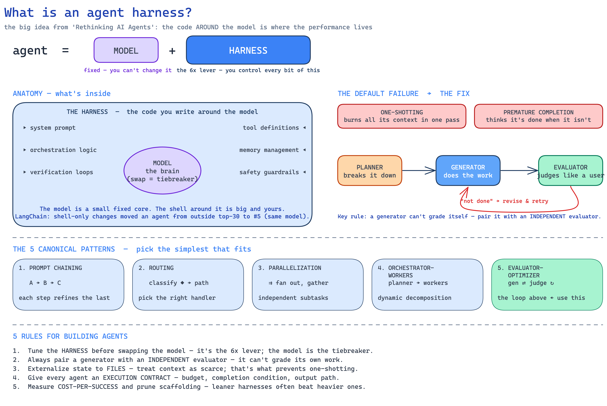

# The design philosophy: harness engineering

Agentic OS is built on one idea about agents: **`agent = model + harness`**, and in production the
harness, not the model, is where the controllable performance lives. The orchestration code around a
model (Stanford's measurement) drives roughly a 6x swing in results independent of the weights. LangChain
reproduced it: harness changes alone, same model, moved a coding agent from outside the top 30 to #5 on
Terminal Bench 2.

The harness is everything you write around the model: the system prompt, the tool definitions (MCP tools
count), the orchestration logic, memory management, verification loops, and safety guardrails. That is
exactly the surface this brain treats as load-bearing. The recall-before-acting rule is a system prompt
decision. The two MCP tools are the tool layer. The daily canary and the health check are verification
loops. The inbox-to-promote gate is orchestration and a guardrail at once.

## Two failure modes it designs against

One-shotting: an agent burns its whole context in a single pass and runs out. The fix is to externalize
state to files and chunk the work, which is why the knowledge lives in markdown the agents read and write
rather than in a context window.

Premature completion: partial progress read as done. The fix is an explicit evaluator with real
completion conditions, not the generator's own optimism. In this system the human merge is that
evaluator, and the acceptance metric measures it.

## The rules it follows

- Tune the harness before swapping the model. The model is the tiebreaker.
- Pair a generator with an independent evaluator; it cannot grade its own work.
- Externalize state to files; treat context as scarce.
- Give every agent an execution contract: a budget, a completion condition, an output path.
- Measure cost per success and prune scaffolding. Leaner harnesses often beat heavier ones.

The last rule is why the dashboard tracks cost per accepted note, and why the cloud agents are capped at
drafting a pull request.
